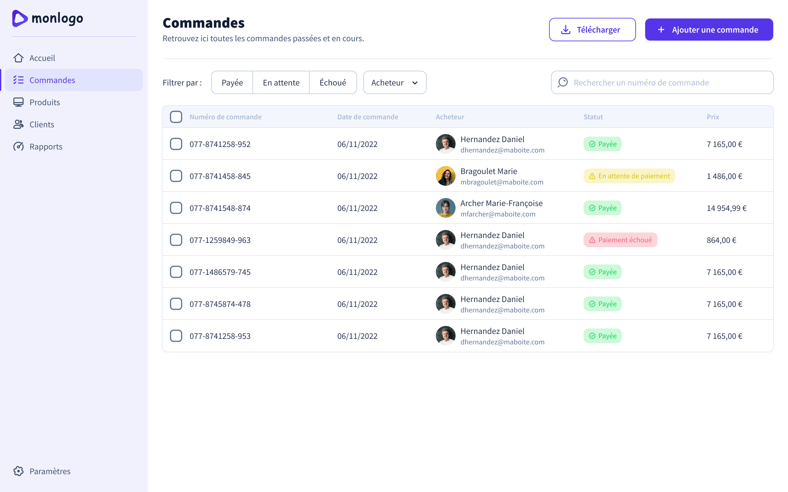

# Intégration d'une interface de consultation de commandes

## Contexte

Une nouvelle interface permettant à l’utilisateur de consulter les commandes envoyées par ses collaborateurs doit être ajoutée à au produit de gestion d’achats de matériel professionnel.

Le product designer a livré la maquette et un développeur front-end a déjà préparé le terrain. Il ne reste plus qu’à intégrer le design prévu.

## Cahier des charges

1. Respecter la maquette fournie.
2. S'assurer que l’interface se comporte correctement sur tous les écrans du mobile aux écrans larges.
3. Le logo du produit doit toujours rester visible.
4. La navigation doit rester facile d’accès sur mobile.
5. L’interface doit être compatible sur les dernières versions de Chrome / Firefox / Safari / Edge.
7. Les boutons “Télécharger” et “Ajouter une commande” n’ont pas besoin d’être fonctionnels.

Le développeur a fourni un composant HTML dans le fichier `app.component.html` en essayant de se rapprocher de la maquette.

## Sources

La maquette et tous les assets nécessaires au projet se trouvent dans la partie assets du [projet Figma](https://www.figma.com/file/ECWWfZYw2B5X8mLvkQrFdT/interface?node-id=2%3A2&t=6OLbh8YGkPYjGjv9-1).

## Livrable

- [Maquette intégrée](https://pascaltassel.github.io/responsive-integration/).
- [Méthodologie](methodology.md).

## Environnement

Ce projet a été généré avec [Angular CLI](https://github.com/angular/angular-cli) version 14.1.0.

Pour travailler dessus vous aurez besoin de :
- Node.js (v14.15 ou plus),
- NPM (v7 ou plus).

Pour vérifier les versions installées sur votre machine :
- `node -v`,
- `npm -v`.

Vous pouvez installer Node et NPM depuis ce lien : [https://nodejs.org](https://nodejs.org).

Vous pouvez installer Angular CLI depuis ce lien : [https://www.npmjs.com/package/@angular/cli/v/14.1.0](https://www.npmjs.com/package/@angular/cli/v/14.1.0).

## Lancer le projet

Pour installer les dépendances projet, lancez la commande `npm ci` dans le dossier racine.

Vous pouvez démarrer le serveur avec la commande `npm start` depuis le même dossier, l'application sera disponible sur l'url http://localhost:4200.
